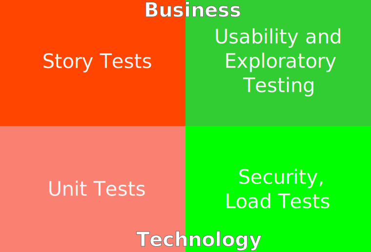
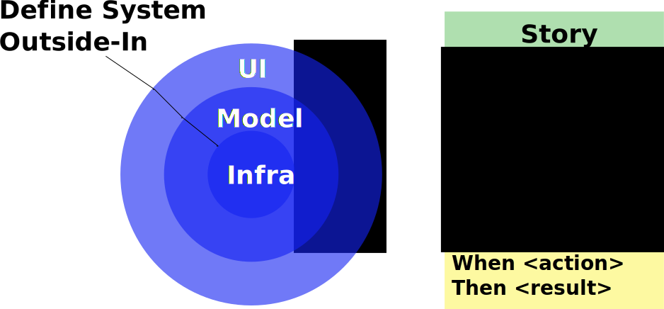
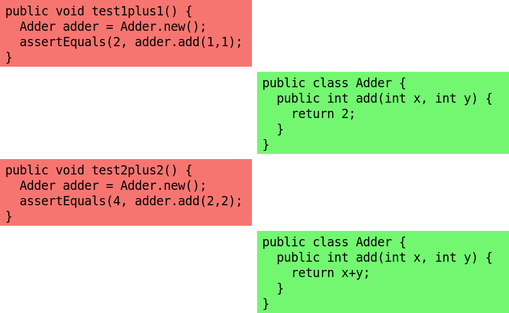
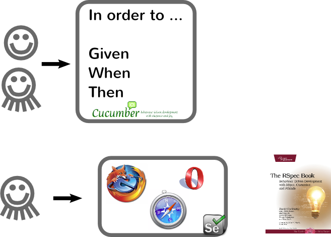
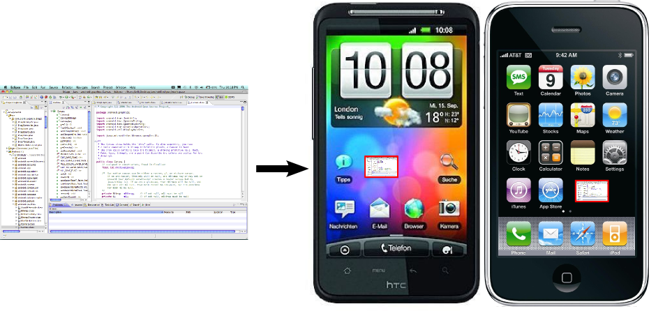

<!SLIDE center>

# Different Kind of Tests

.notes We will stay on the left side today

<!SLIDE center>

# Basic BDD Flow

<!SLIDE center>

# Writing Examples First

<!SLIDE center>

# What We Are Used To

.notes High Maturity. Tools are part of process, not only technical

<!SLIDE bullets>

# What We Have In Mobile

* Basically where we where with Java web testing in 2001
* Slow, runs in container
* Relies on unpublished API:s

<!SLIDE center>

# Testing on the phone/simulator

<!SLIDE center>

# The Problem

<!SLIDE bullets>

# The Result

* Unit Tests That Aren't Really Unit Tests
* No Real Black Box Tests

<!SLIDE bullets>

# iOS Tools

* OCUnit
* Cedar
* KIF

.notes Runs in simulator

<!SLIDE bullets>

# Android Tools

* Robotium - runs in Emulator
* Robolectric - runs in VM

<!SLIDE bullets>

# The Monkey

* Part of Android
* Clicks pseudo-randomly
* Easy to use

<!SLIDE commandline>

$ adb shell monkey [options] <event-count>

<!SLIDE bullets>

# What We've Done

* Gave up on existing tools
* Broke out logic into separate classes
  * JUnit4
  * OCUnit
* No integration tests

<!SLIDE bullets>

# Future

* Dependency Injection?
  * RoboGuice
  * Objection

.notes Cmpr Spring, explain difficulty

<!SLIDE bullets>

# Web Applications

* Runs in the browser
* Testable using standard webtools
* Can be run through Selenium on both iOS and Android
